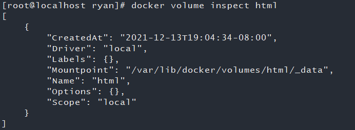

## Docker Volume

### 1.创建数据卷

```bash
docker volume create html
```

### 2.显示一个或多个数据卷的信息

```bash
docker volume inspect html
```



### 3.显示所有的数据卷

```bash
docker volume ls
```

### 4.删除未使用的数据卷

```bash
docker volume prune
```

### 5.使用

```bash
docker run --name my-nginx -p 80:80 -v html:/usr/share/nginx/html -d nginx
```